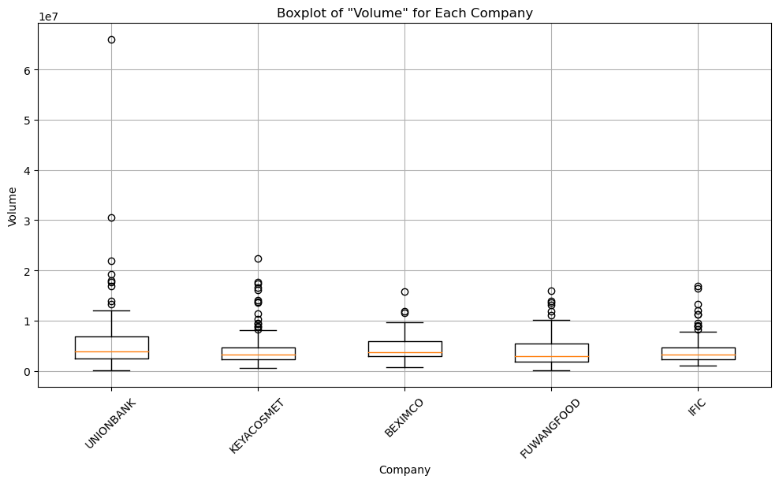

```python
import pandas as pd
import matplotlib as mlb
import matplotlib.pyplot as plt
import matplotlib.dates as mdates
import seaborn as sns
import numpy as np
```


```python
Stock_Market_Data=pd.read_csv('Stock_Market_Data.csv')
Stock_Market_Data
```


<div>
<style scoped>
    .dataframe tbody tr th:only-of-type {
        vertical-align: middle;
    }

    .dataframe tbody tr th {
        vertical-align: top;
    }

    .dataframe thead th {
        text-align: right;
    }
</style>
<table border="1" class="dataframe">
  <thead>
    <tr style="text-align: right;">
      <th></th>
      <th>Date</th>
      <th>Name</th>
      <th>Open</th>
      <th>High</th>
      <th>Low</th>
      <th>Close</th>
      <th>Volume</th>
    </tr>
  </thead>
  <tbody>
    <tr>
      <th>0</th>
      <td>02-01-2022</td>
      <td>01.Bank</td>
      <td>22.83</td>
      <td>23.20</td>
      <td>22.59</td>
      <td>22.93</td>
      <td>1842350.41</td>
    </tr>
    <tr>
      <th>1</th>
      <td>03-01-2022</td>
      <td>01.Bank</td>
      <td>23.03</td>
      <td>23.29</td>
      <td>22.74</td>
      <td>22.90</td>
      <td>1664989.63</td>
    </tr>
    <tr>
      <th>2</th>
      <td>04-01-2022</td>
      <td>01.Bank</td>
      <td>22.85</td>
      <td>23.13</td>
      <td>22.64</td>
      <td>22.84</td>
      <td>1354510.97</td>
    </tr>
    <tr>
      <th>3</th>
      <td>05-01-2022</td>
      <td>01.Bank</td>
      <td>22.91</td>
      <td>23.20</td>
      <td>22.70</td>
      <td>22.98</td>
      <td>1564334.81</td>
    </tr>
    <tr>
      <th>4</th>
      <td>06-01-2022</td>
      <td>01.Bank</td>
      <td>23.12</td>
      <td>23.65</td>
      <td>23.00</td>
      <td>23.37</td>
      <td>2586344.19</td>
    </tr>
    <tr>
      <th>...</th>
      <td>...</td>
      <td>...</td>
      <td>...</td>
      <td>...</td>
      <td>...</td>
      <td>...</td>
      <td>...</td>
    </tr>
    <tr>
      <th>49153</th>
      <td>26-06-2022</td>
      <td>ZEALBANGLA</td>
      <td>169.00</td>
      <td>174.90</td>
      <td>169.00</td>
      <td>170.30</td>
      <td>10480.00</td>
    </tr>
    <tr>
      <th>49154</th>
      <td>27-06-2022</td>
      <td>ZEALBANGLA</td>
      <td>174.10</td>
      <td>176.00</td>
      <td>166.90</td>
      <td>167.50</td>
      <td>13817.00</td>
    </tr>
    <tr>
      <th>49155</th>
      <td>28-06-2022</td>
      <td>ZEALBANGLA</td>
      <td>170.00</td>
      <td>170.90</td>
      <td>167.00</td>
      <td>168.10</td>
      <td>5214.00</td>
    </tr>
    <tr>
      <th>49156</th>
      <td>29-06-2022</td>
      <td>ZEALBANGLA</td>
      <td>167.10</td>
      <td>169.00</td>
      <td>164.90</td>
      <td>165.10</td>
      <td>6678.00</td>
    </tr>
    <tr>
      <th>49157</th>
      <td>30-06-2022</td>
      <td>ZEALBANGLA</td>
      <td>165.10</td>
      <td>174.00</td>
      <td>164.00</td>
      <td>172.20</td>
      <td>5883.00</td>
    </tr>
  </tbody>
</table>
<p>49158 rows × 7 columns</p>
</div>


```python
Stock_Market_Data['Date']=pd.to_datetime(Stock_Market_Data['Date'],dayfirst=True)
```

## Data Cleaning and Exploration:

#####  basic statistics  summary for each column


```python
explore=Stock_Market_Data.describe().round(2)
explore
```


<div>
<style scoped>
    .dataframe tbody tr th:only-of-type {
        vertical-align: middle;
    }

    .dataframe tbody tr th {
        vertical-align: top;
    }

    .dataframe thead th {
        text-align: right;
    }
</style>
<table border="1" class="dataframe">
  <thead>
    <tr style="text-align: right;">
      <th></th>
      <th>Open</th>
      <th>High</th>
      <th>Low</th>
      <th>Close</th>
      <th>Volume</th>
    </tr>
  </thead>
  <tbody>
    <tr>
      <th>count</th>
      <td>49158.00</td>
      <td>49158.00</td>
      <td>49158.00</td>
      <td>49158.00</td>
      <td>49158.00</td>
    </tr>
    <tr>
      <th>mean</th>
      <td>157.87</td>
      <td>159.59</td>
      <td>155.91</td>
      <td>157.35</td>
      <td>561999.93</td>
    </tr>
    <tr>
      <th>std</th>
      <td>520.19</td>
      <td>523.35</td>
      <td>517.14</td>
      <td>519.71</td>
      <td>1276908.70</td>
    </tr>
    <tr>
      <th>min</th>
      <td>3.90</td>
      <td>3.90</td>
      <td>3.00</td>
      <td>3.80</td>
      <td>1.00</td>
    </tr>
    <tr>
      <th>25%</th>
      <td>19.00</td>
      <td>19.30</td>
      <td>18.70</td>
      <td>19.00</td>
      <td>51094.75</td>
    </tr>
    <tr>
      <th>50%</th>
      <td>40.30</td>
      <td>41.00</td>
      <td>39.53</td>
      <td>40.10</td>
      <td>182416.00</td>
    </tr>
    <tr>
      <th>75%</th>
      <td>89.40</td>
      <td>90.50</td>
      <td>87.70</td>
      <td>88.70</td>
      <td>540139.75</td>
    </tr>
    <tr>
      <th>max</th>
      <td>6000.00</td>
      <td>6050.00</td>
      <td>5975.00</td>
      <td>6000.50</td>
      <td>65931798.00</td>
    </tr>
  </tbody>
</table>
</div>


##### Top 5 Companies Based on 'Volume'


```python
top_5_companies = Stock_Market_Data.groupby('Name')['Volume'].sum().nlargest(5).index.tolist()
top_5_companies
```


    ['UNIONBANK', 'KEYACOSMET', 'BEXIMCO', 'FUWANGFOOD', 'IFIC']


```python
Top_5_Company_Data = Stock_Market_Data[Stock_Market_Data['Name'].isin(top_5_companies)]
Top_5_Company_Data
```


<div>
<style scoped>
    .dataframe tbody tr th:only-of-type {
        vertical-align: middle;
    }

    .dataframe tbody tr th {
        vertical-align: top;
    }

    .dataframe thead th {
        text-align: right;
    }
</style>
<table border="1" class="dataframe">
  <thead>
    <tr style="text-align: right;">
      <th></th>
      <th>Date</th>
      <th>Name</th>
      <th>Open</th>
      <th>High</th>
      <th>Low</th>
      <th>Close</th>
      <th>Volume</th>
    </tr>
  </thead>
  <tbody>
    <tr>
      <th>1828</th>
      <td>2022-01-02</td>
      <td>BEXIMCO</td>
      <td>150.3</td>
      <td>154.5</td>
      <td>149.5</td>
      <td>154.1</td>
      <td>6482374.0</td>
    </tr>
    <tr>
      <th>1829</th>
      <td>2022-01-03</td>
      <td>BEXIMCO</td>
      <td>155.4</td>
      <td>159.9</td>
      <td>154.6</td>
      <td>156.9</td>
      <td>11519937.0</td>
    </tr>
    <tr>
      <th>1830</th>
      <td>2022-01-04</td>
      <td>BEXIMCO</td>
      <td>157.4</td>
      <td>157.4</td>
      <td>151.6</td>
      <td>152.6</td>
      <td>6918142.0</td>
    </tr>
    <tr>
      <th>1831</th>
      <td>2022-01-05</td>
      <td>BEXIMCO</td>
      <td>153.5</td>
      <td>154.0</td>
      <td>149.5</td>
      <td>150.0</td>
      <td>6632703.0</td>
    </tr>
    <tr>
      <th>1832</th>
      <td>2022-01-06</td>
      <td>BEXIMCO</td>
      <td>151.1</td>
      <td>152.0</td>
      <td>149.0</td>
      <td>149.9</td>
      <td>7455503.0</td>
    </tr>
    <tr>
      <th>...</th>
      <td>...</td>
      <td>...</td>
      <td>...</td>
      <td>...</td>
      <td>...</td>
      <td>...</td>
      <td>...</td>
    </tr>
    <tr>
      <th>48735</th>
      <td>2022-06-26</td>
      <td>UNIONBANK</td>
      <td>10.3</td>
      <td>10.4</td>
      <td>10.2</td>
      <td>10.2</td>
      <td>1707584.0</td>
    </tr>
    <tr>
      <th>48736</th>
      <td>2022-06-27</td>
      <td>UNIONBANK</td>
      <td>10.3</td>
      <td>10.3</td>
      <td>10.1</td>
      <td>10.3</td>
      <td>2989712.0</td>
    </tr>
    <tr>
      <th>48737</th>
      <td>2022-06-28</td>
      <td>UNIONBANK</td>
      <td>10.3</td>
      <td>10.4</td>
      <td>10.2</td>
      <td>10.2</td>
      <td>1536415.0</td>
    </tr>
    <tr>
      <th>48738</th>
      <td>2022-06-29</td>
      <td>UNIONBANK</td>
      <td>10.3</td>
      <td>10.5</td>
      <td>10.2</td>
      <td>10.3</td>
      <td>2555675.0</td>
    </tr>
    <tr>
      <th>48739</th>
      <td>2022-06-30</td>
      <td>UNIONBANK</td>
      <td>10.3</td>
      <td>10.3</td>
      <td>10.1</td>
      <td>10.3</td>
      <td>6726621.0</td>
    </tr>
  </tbody>
</table>
<p>590 rows × 7 columns</p>
</div>


##### Distribution of the 'Close' prices over time for top 5 company.


```python
for company in top_5_companies:
    plt.figure(figsize=(8, 6))
    company_data = Stock_Market_Data[Stock_Market_Data['Name'] == company]
    plt.hist(company_data['Close'], bins=30, alpha=.8)
    plt.title(f'Distribution of Close Prices for {company}')
    plt.xlabel('Close Price')
    plt.ylabel('Frequency')
    plt.grid()
    plt.show()
```


    

    


    

    


    

    


    

    


    

    


##### Identifying and analyzing any outliers


```python
for column in Top_5_Company_Data.columns.difference(['Date', 'Name']):
    plt.figure(figsize=(12, 6))
    plt.title(f'Boxplot of "{column}" for Each Company')
    plt.xlabel('Company')
    plt.ylabel(column)
    plt.boxplot([Stock_Market_Data[Stock_Market_Data['Name'] == name][column] for name in top_5_companies], labels=top_5_companies)
    plt.xticks(rotation=45)
    plt.grid()
    plt.show()
```


    

    


    

    


    

    


    

    


    

    


```python

```

## Time Series Analysis / Rolling Window / Moving Averages :

##### line chart to visualize the 'Close' prices over time.


```python
plt.figure(figsize=(12,6))
for company in top_5_companies:
    Data = Stock_Market_Data[Stock_Market_Data['Name']==company]
    plt.plot(Data['Date'],Data['Close'],label=company)
plt.xlabel('Date')
plt.ylabel('Close Price')
plt.title('Close Price Over Time')
plt.grid()
plt.xticks(rotation=45)
plt.legend()
plt.show()
```


    

    


##### 2.Calculating and ploting the daily percentage change in closing prices.


```python
for company in top_5_companies:
    plt.figure(figsize=(6, 4))
    company_data = Stock_Market_Data[Stock_Market_Data['Name'] == company].copy()
    company_data['Daily_PCT_Change'] = company_data['Close'].pct_change()
    plt.plot(company_data['Date'], company_data['Daily_PCT_Change'], label=company)
    plt.xlabel('Date')
    plt.ylabel('Daily Percentage Change')
    plt.title(f'Daily Percentage Change in Closing Prices of {company}')
    plt.legend()
    plt.grid()
    plt.xticks(rotation=45)
    plt.show()
```


    

    


    

    


    

    


    

    


    

    


##### Investigating the presence of any trends or seasonality in the stock prices.


```python
Monthly_data = Stock_Market_Data.resample("M", on="Date")[["Open", "Close"]].mean()
plt.figure(figsize=(12, 6))
plt.plot(Monthly_data.index.month_name(), Monthly_data["Open"], marker="o", label="Open")
plt.plot(Monthly_data.index.month_name(), Monthly_data["Close"], marker="D", label="Close")
plt.xlabel("Month")
plt.ylabel("Stock Price")
plt.title("Stock Prices (Open & Close) - Monthly Averages")
plt.legend()
plt.grid()
plt.show()

```


    

    

=> Both the Open and Close stock prices exhibit a consistent Ups and Down trend from January to June.

=> The significant drop between February and March suggests a potential seasonal effect or market volatility during that period.The subsequent recovery starting in May indicates a positive trend.

=> The Open and Close prices follow similar patterns, indicating that they move together. When the Open price is high, the Close price tends to be high as well, and vice versa.

=> The stock prices remain relatively stable within a narrow range. The difference between the Open and Close prices is minimal.
##### Applying moving averages to smooth the time series data in 15,30 day intervals against the original graph.


```python
for company in top_5_companies:
    plt.figure(figsize=(6,4))
    company_data = Stock_Market_Data[Stock_Market_Data['Name'] == company].copy()
    plt.plot(company_data['Date'], company_data['Close'], label=company, color='blue')
    
    company_data['15_Day_Moving_Average'] = company_data['Close'].rolling(window=15).mean()
    company_data['30_Day_Moving_Average'] = company_data['Close'].rolling(window=30).mean()
    plt.plot(company_data['Date'], company_data['15_Day_Moving_Average'], label=f'{company} - 15 Day Moving Average', linestyle='--', color='green')
    plt.plot(company_data['Date'], company_data['30_Day_Moving_Average'], label=f'{company} - 30 Day Moving Average', linestyle=':', color='red')

    plt.title(f'Moving Averages Stock Prices of: {company}')
    plt.xlabel('Date')
    plt.ylabel('Closing Price')
    plt.legend()
    plt.grid()
    plt.xticks(rotation=45)
    plt.show()
```


    

    


    

    


    

    


    

    


    

    


##### Calculating the average closing price for each stock.


```python
Average_Closing_Price = Stock_Market_Data.groupby('Name')['Close'].mean()
Average_Closing_Price
```


    Name
    01.Bank                       21.260902
    02.Cement                     96.600820
    03.Ceramics_Sector            71.225164
    04.Engineering               132.352459
    05.Financial_Institutions     29.253525
                                    ...    
    WMSHIPYARD                    12.370492
    YPL                           21.339344
    ZAHEENSPIN                     9.964754
    ZAHINTEX                       7.858197
    ZEALBANGLA                   150.338525
    Name: Close, Length: 412, dtype: float64


##### Identifying the top 5 and bottom 5 stocks based on average closing price


```python
top_5_stocks = Average_Closing_Price.sort_values(ascending=False).head(5)
bottom_5_stocks = Average_Closing_Price.sort_values(ascending=True).head(5)
print("\nTop 5 Stocks based on Average Closing Price: \n", top_5_stocks)
print("\nBottom 5 Stocks based on Average Closing Price:\n", bottom_5_stocks)
```

    
    Top 5 Stocks based on Average Closing Price: 
     Name
    APSCLBOND     5413.238636
    RECKITTBEN    5342.024793
    PREBPBOND     4918.357143
    IBBL2PBOND    4851.330357
    PBLPBOND      4836.195652
    Name: Close, dtype: float64
    
    Bottom 5 Stocks based on Average Closing Price:
     Name
    FAMILYTEX     4.698361
    ICBIBANK      4.725620
    FBFIF         5.289344
    POPULAR1MF    5.368033
    PHPMF1        5.417213
    Name: Close, dtype: float64
    


```python

```

## Volatility Analysis:

##### Calculating and ploting the rolling standard deviation of the 'Close' prices.


```python
plt.figure(figsize=(15, 8))
for company in top_5_companies:
    company_data = Stock_Market_Data[Stock_Market_Data['Name'] == company]
    rolling_std = company_data['Close'].rolling(window=30).std()
    plt.plot(company_data['Date'],rolling_std,linestyle='--', label=company)
plt.xlabel('Date')
plt.ylabel('Rolling Standard Deviation')
plt.title('30 days Rolling Standard Deviation of Close Prices for Each Company')
plt.legend()
plt.xticks(rotation=45)
plt.grid()
plt.show()
```


    

    


##### Creating a new column for daily price change (Close - Open).


```python
Stock_Market_Data['Daily_Price_Change'] = Stock_Market_Data['Close']-Stock_Market_Data['Open']
Stock_Market_Data
```


<div>
<style scoped>
    .dataframe tbody tr th:only-of-type {
        vertical-align: middle;
    }

    .dataframe tbody tr th {
        vertical-align: top;
    }

    .dataframe thead th {
        text-align: right;
    }
</style>
<table border="1" class="dataframe">
  <thead>
    <tr style="text-align: right;">
      <th></th>
      <th>Date</th>
      <th>Name</th>
      <th>Open</th>
      <th>High</th>
      <th>Low</th>
      <th>Close</th>
      <th>Volume</th>
      <th>Daily_Price_Change</th>
    </tr>
  </thead>
  <tbody>
    <tr>
      <th>0</th>
      <td>2022-01-02</td>
      <td>01.Bank</td>
      <td>22.83</td>
      <td>23.20</td>
      <td>22.59</td>
      <td>22.93</td>
      <td>1842350.41</td>
      <td>0.10</td>
    </tr>
    <tr>
      <th>1</th>
      <td>2022-01-03</td>
      <td>01.Bank</td>
      <td>23.03</td>
      <td>23.29</td>
      <td>22.74</td>
      <td>22.90</td>
      <td>1664989.63</td>
      <td>-0.13</td>
    </tr>
    <tr>
      <th>2</th>
      <td>2022-01-04</td>
      <td>01.Bank</td>
      <td>22.85</td>
      <td>23.13</td>
      <td>22.64</td>
      <td>22.84</td>
      <td>1354510.97</td>
      <td>-0.01</td>
    </tr>
    <tr>
      <th>3</th>
      <td>2022-01-05</td>
      <td>01.Bank</td>
      <td>22.91</td>
      <td>23.20</td>
      <td>22.70</td>
      <td>22.98</td>
      <td>1564334.81</td>
      <td>0.07</td>
    </tr>
    <tr>
      <th>4</th>
      <td>2022-01-06</td>
      <td>01.Bank</td>
      <td>23.12</td>
      <td>23.65</td>
      <td>23.00</td>
      <td>23.37</td>
      <td>2586344.19</td>
      <td>0.25</td>
    </tr>
    <tr>
      <th>...</th>
      <td>...</td>
      <td>...</td>
      <td>...</td>
      <td>...</td>
      <td>...</td>
      <td>...</td>
      <td>...</td>
      <td>...</td>
    </tr>
    <tr>
      <th>49153</th>
      <td>2022-06-26</td>
      <td>ZEALBANGLA</td>
      <td>169.00</td>
      <td>174.90</td>
      <td>169.00</td>
      <td>170.30</td>
      <td>10480.00</td>
      <td>1.30</td>
    </tr>
    <tr>
      <th>49154</th>
      <td>2022-06-27</td>
      <td>ZEALBANGLA</td>
      <td>174.10</td>
      <td>176.00</td>
      <td>166.90</td>
      <td>167.50</td>
      <td>13817.00</td>
      <td>-6.60</td>
    </tr>
    <tr>
      <th>49155</th>
      <td>2022-06-28</td>
      <td>ZEALBANGLA</td>
      <td>170.00</td>
      <td>170.90</td>
      <td>167.00</td>
      <td>168.10</td>
      <td>5214.00</td>
      <td>-1.90</td>
    </tr>
    <tr>
      <th>49156</th>
      <td>2022-06-29</td>
      <td>ZEALBANGLA</td>
      <td>167.10</td>
      <td>169.00</td>
      <td>164.90</td>
      <td>165.10</td>
      <td>6678.00</td>
      <td>-2.00</td>
    </tr>
    <tr>
      <th>49157</th>
      <td>2022-06-30</td>
      <td>ZEALBANGLA</td>
      <td>165.10</td>
      <td>174.00</td>
      <td>164.00</td>
      <td>172.20</td>
      <td>5883.00</td>
      <td>7.10</td>
    </tr>
  </tbody>
</table>
<p>49158 rows × 8 columns</p>
</div>


##### Analyzing the distribution of daily price changes.


```python
for company in top_5_companies:
    company_data = Stock_Market_Data[Stock_Market_Data['Name']==company]
    plt.figure(figsize=(10, 6))
    plt.hist(company_data['Daily_Price_Change'], bins=30, color='skyblue', edgecolor='black')
    plt.title(f'Distribution of Daily Price Changes for {company}')
    plt.xlabel('Daily Price Change')
    plt.ylabel('Frequency')
    plt.grid(True)
    plt.show()
```


    

    


    

    


    

    


    

    


    

    


##### Identifying days with the largest price increases and decreases.


```python
largest_increase = Stock_Market_Data.nlargest(1, 'Daily_Price_Change')
print("Days with the largest price increases:")
print(largest_increase[['Date','Name', 'Daily_Price_Change']])

largest_decrease = Stock_Market_Data.nsmallest(1, 'Daily_Price_Change')
print("\nDays with the largest price decreases:")
print(largest_decrease[['Date','Name', 'Daily_Price_Change']])
```

    Days with the largest price increases:
                Date        Name  Daily_Price_Change
    48081 2022-06-29  SJIBLPBOND               187.0
    
    Days with the largest price decreases:
                Date        Name  Daily_Price_Change
    23365 2022-03-07  RECKITTBEN              -189.2
    

##### Identifying stocks with unusually high trading volume on certain days.


```python
for company in top_5_companies:
    company_data = Stock_Market_Data[Stock_Market_Data['Name'] == company]
    plt.plot(company_data['Date'],company_data['Volume'],label = company)

    threshold = company_data['Volume'].quantile(0.95)
    unusual_data = company_data[company_data['Volume'] > threshold]
    plt.scatter(unusual_data['Date'], unusual_data['Volume'], color="red", marker='o', label=f'{company} - Unusual High Trading Volume')

    plt.title(f'Unusually High Trading voume of {company}')
    plt.xlabel('Date')
    plt.ylabel('Trading Volume')
    plt.legend()
    plt.grid()
    plt.show()
```


    

    


    

    


    

    


    

    


    

    


```python

```

## Correlation and Heatmaps:

##### Exploring the relationship between trading volume and volatility


```python
correlation_df = pd.DataFrame(index=top_5_companies, columns=['Correlation'])
correlation_df['Correlation'] = pd.to_numeric(correlation_df['Correlation'])

for company in top_5_companies:
    company_data = Stock_Market_Data[Stock_Market_Data['Name'] == company].copy()  # Make a copy to avoid SettingWithCopyWarning
    company_data['Volatility'] = company_data['Close'].pct_change().rolling(window=30).std()
    correlation = company_data[['Volume', 'Volatility']].corr().iloc[0, 1]
    correlation_df.loc[company, 'Correlation'] = correlation
    
plt.figure(figsize=(8, 6))
sns.heatmap(correlation_df, annot=True, cmap='coolwarm', fmt=".2f")
plt.title('Correlation Heatmap: Trading Volume vs. Volatility')
plt.show()

for company in top_5_companies:
    company_data = Stock_Market_Data[Stock_Market_Data['Name'] == company].copy()
    company_data['Volatility'] = company_data['Close'].pct_change().rolling(window=30).std()
    sns.regplot(x=company_data['Volume'], y=company_data['Volatility'],ci= None)
    plt.title(f'Relationship between Trading Volume and Volatility for :{company}')
    plt.xlabel('Trading Volume')
    plt.ylabel('Volatility')
    plt.grid()
    plt.show()
```


    

    


    

    


    

    


    

    


    

    


    

    


##### Calculating the correlation matrix between the 'Open' & 'High', 'Low' &'Close' prices.


```python
for company in top_5_companies:
    company_data = Stock_Market_Data[Stock_Market_Data['Name']==company].copy()
    correlation_matrix = company_data[['Open', 'High', 'Low', 'Close']].corr()
    print(f' correlation_matrix of \033[1m{company}\033[0m')
    print(f'\n{correlation_matrix}\n')
```

     correlation_matrix of UNIONBANK
    
               Open      High       Low     Close
    Open   1.000000  0.984464  0.983739  0.969240
    High   0.984464  1.000000  0.978242  0.988152
    Low    0.983739  0.978242  1.000000  0.984388
    Close  0.969240  0.988152  0.984388  1.000000
    
     correlation_matrix of KEYACOSMET
    
               Open      High       Low     Close
    Open   1.000000  0.945815  0.965903  0.927996
    High   0.945815  1.000000  0.949416  0.973697
    Low    0.965903  0.949416  1.000000  0.966941
    Close  0.927996  0.973697  0.966941  1.000000
    
     correlation_matrix of BEXIMCO
    
               Open      High       Low     Close
    Open   1.000000  0.977330  0.977721  0.955140
    High   0.977330  1.000000  0.974154  0.981667
    Low    0.977721  0.974154  1.000000  0.983281
    Close  0.955140  0.981667  0.983281  1.000000
    
     correlation_matrix of FUWANGFOOD
    
               Open      High       Low     Close
    Open   1.000000  0.973726  0.981517  0.951527
    High   0.973726  1.000000  0.971483  0.983469
    Low    0.981517  0.971483  1.000000  0.975536
    Close  0.951527  0.983469  0.975536  1.000000
    
     correlation_matrix of IFIC
    
               Open      High       Low     Close
    Open   1.000000  0.996165  0.997160  0.994205
    High   0.996165  1.000000  0.996410  0.998139
    Low    0.997160  0.996410  1.000000  0.997411
    Close  0.994205  0.998139  0.997411  1.000000
    
    

##### Creating  heatmap to visualize the correlations using the seaborn package.


```python
for company in top_5_companies:
    company_data = Stock_Market_Data[Stock_Market_Data['Name']==company].copy()
    plt.figure(figsize=(3,3))
    sns.heatmap(correlation_matrix, annot=True,cmap='plasma',fmt='.2f',linewidths=.5)
    plt.title(f'Correlation Heatmap for {company}')
    plt.show()
```


    

    


    

    


    

    


    

    


    

    


```python

```
